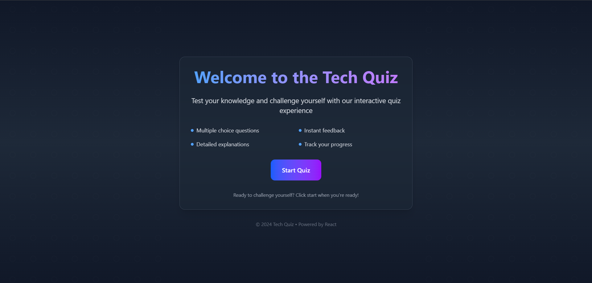
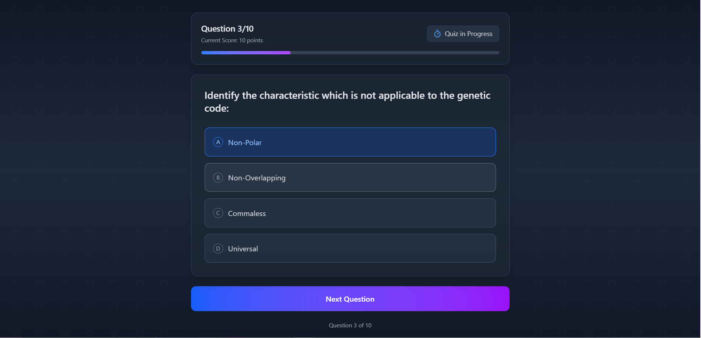
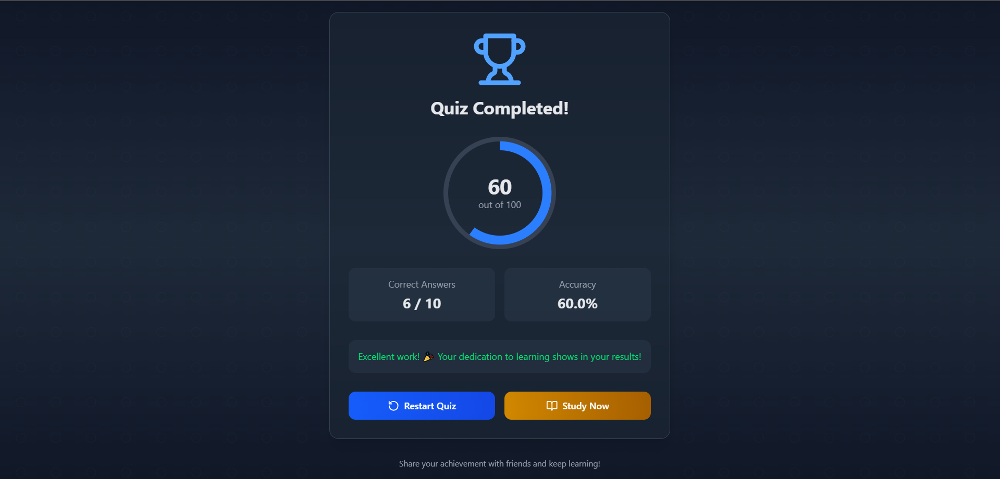
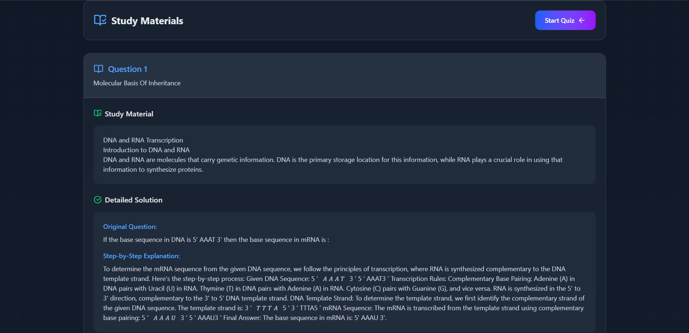

live link :- https://quiz-app-vert-rho.vercel.app/
# Tech Quiz Application

An interactive web application designed to challenge and enhance your technical knowledge. This app provides a smooth quiz-taking experience with multiple-choice questions, real-time feedback, and score tracking.

---

## Features

- **Dynamic Start Screen**: A visually appealing welcome screen to set the tone for the quiz.
- **Interactive Quiz**:
  - Multiple-choice questions.
  - Instant feedback on answers.
  - Progress tracking with a responsive progress bar.
- **Real-time Score Calculation**: Scores are updated dynamically based on correct answers.
- **Error Handling**:
  - Displays loading spinner during data fetching.
  - Error message for issues like API failures.
- **Responsive Design**: Optimized for all screen sizes with modern UI aesthetics.

---

## Tech Stack

- **Frontend**: React.js
- **UI Styling**: Tailwind CSS
- **Icons**: Lucide-react
- **Backend Integration**: Axios for API requests
- **State Management**: React useState and useEffect hooks

---

## Folder Structure

```
├── src
│   ├── components
│   │   ├── StartScreen.js
│   │   └── QuizScreen.js
│   │   └── ResultScreen.js
│   │   └── StudyScreen.js
│   ├── App.js
│   └── index.js
├── public
│   ├── index.html
│   └── ...
├── package.json
└── README.md
```

---

## Installation

1. Clone the repository:
   ```bash
   git clone https://github.com/YashWagh9920/Quiz-app.git
   cd Quiz-app
   ```

2. Install dependencies:
   ```bash
   npm install
   ```

3. Start the development server:
   ```bash
   npm run dev
   ```

---

## Usage

1. Run the application in your browser:
   - Open [http://localhost:5173/](http://localhost:5173/).
2. Click the **Start Quiz** button to begin.
3. Select your answers and navigate through the quiz.
4. View your final score and track your progress.

---

## API Integration

- The app fetches quiz questions from an API endpoint using Axios.
- **Endpoint**: `/api/Uw5CrX` (replace with your actual endpoint).
- **Expected Response Structure**:
  ```json
  {
    "questions": [
      {
        "description": "Question text",
        "options": [
          { "description": "Option text", "is_correct": true/false },
          ...
        ]
      },
      ...
    ]
  }
  ```

---

## Customization

- Modify the **API endpoint** in `QuizScreen.js`:
  ```javascript
  const response = await axios.get('/api/Uw5CrX');
  ```
- Update styling via Tailwind CSS classes.
- Extend features like adding a timer or more detailed analytics.

---

## Acknowledgments

- **React.js** for the robust framework.
- **Tailwind CSS** for the responsive and elegant styling.
- **Axios** for seamless API integration.
- **Lucide-react** for the beautiful icons.

---

Enjoy testing your knowledge with Tech Quiz! 🚀





### Demo Video
[Watch the Demo](https://siescms-my.sharepoint.com/:f:/g/personal/yashkwce122_gst_sies_edu_in/Elh4jkrAkhBOokfVKlXzBRYBOPo7whtiE1gL24BRlgCa2w?e=3oIP9I)
